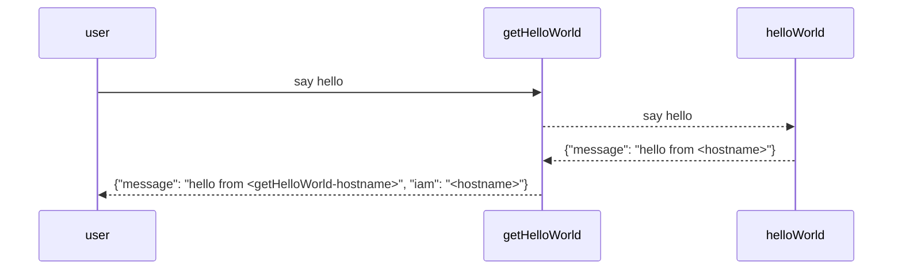

## Automate containerization workshop


## Introduction



2 Applications in fastAPI, you know more about it than me.


## Part 1: Docker and containers

Docker build

- Build "hello world" python application
  cd hello-world && docker build -t hello-world . && cd -

- Build "get_hello_world" python application
  cd get-hello-world && docker build -t get-hello-world && cd -
  

- Exercise: unify dockerfile
  Docker build contexts and -f to point to dockerfile
  https://docs.docker.com/engine/reference/commandline/build/
  ```
  docker build -t hello-world hello-world-fastapi -f Dockerfile
  docker build -t get-hello-world get-hello-world -f Dockerfile
  ```

Docker run
  - Run `hello_world` python application
    - introduce ports exposing
    docker run -d --name hello-world hello-world
      -d dettached
      --name name for the container

  - Run `get_hello_world` python application
  `docker run --link hello-world -e BACKEND_URL="http://hello-world:8000" -p 8000:8000 get-hello-world`
    - Environment (-e environment variables)
    - Links (network) (create a link between applications)

### Wrap-up
tagging and working with tags

## Part 2: Local kubernetes with rancher desktop

Pods x nodes
- Pods are atomic units of your running application.
- Nodes are servers that are part of a cluster with a defined or generic role.

Run a pod
`kubectl run hello-world --image=hello-world-fastapi --image-pull-policy='Never'`

`kubectl run get-hello-world --image=get-hello-world --image-pull-policy='Never' --env BACKEND_URL="http://hello-world.default.svc.cluster.local:8000/" --dry-run=client -o yaml`
A note about DNS names on kubernetes. 

Debugging a pod:
```
kuberctl logs
kubectl describe
```

Expose a pod
`kubectl expose pod get-hello-world --port 8000`

Port forwarding
`k port-forward get-hello-world 8000:8000`

Run a deployment
Scale your applications

kubernetes apply -f deployments.yaml

Exercise: scale up your application

Run an ingress

Faking an external DNS service. `/etc/hosts`

`kubernetes apply -f ingress.yaml`

### Namespaces
